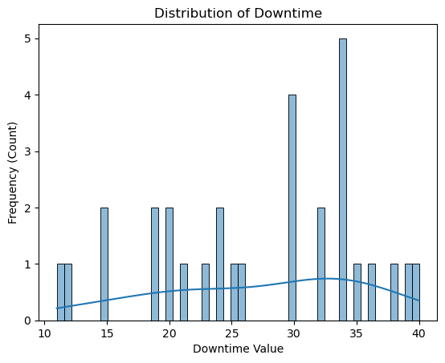
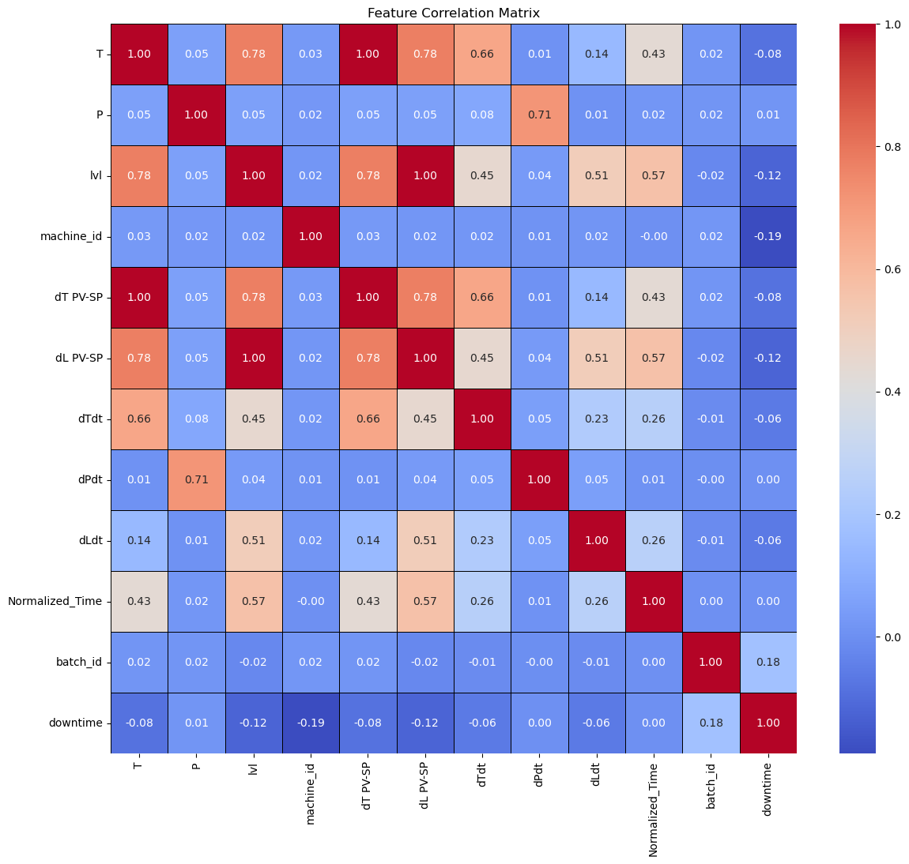
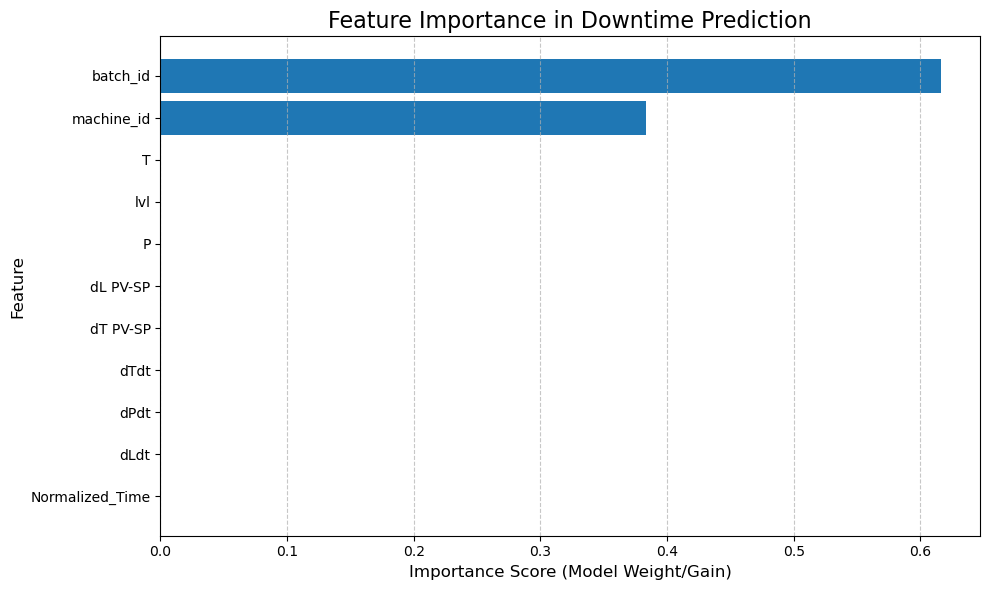
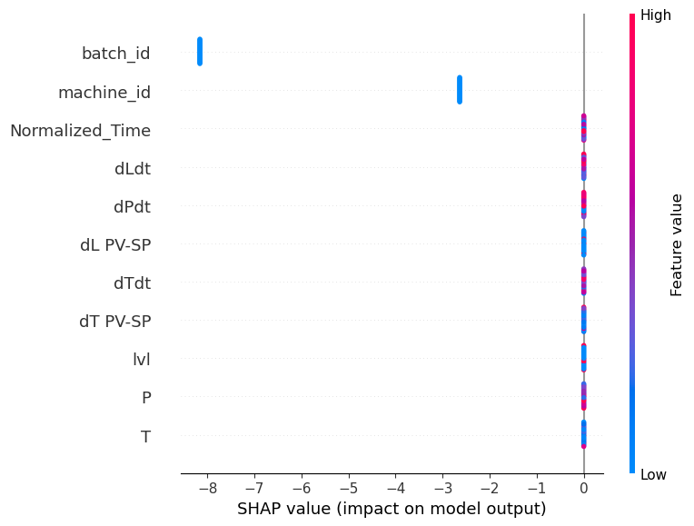

# Process Downtime Root Cause Analysis

## Overview
This project builds a machine learning system to identify key drivers of production downtime using synthetic industrial data.

By analyzing operational parameters such as temperature, machine type, batch number, the system provides actionable insights to reduce downtime and improve operational efficiency.

Variations in production times creates chaos in production planning and has led to missing production throughput targets.

By optimizing the process which shows significant spread, companies can:
- Improve consistency of production throughput
- Enable next stage of optimization to reduce the downtime of each production
- Minimize process overruns

## Features
- The problem is formulated as a feature importance problem.

XGBoost, a Tree-based model was selected because:
- They handle non-linear relationships effectively
- They capture feature interactions without manual engineering
- They provide interpretable feature importance

## Tech Stack
- Python
- NumPy / Pandas
- XGBoost
- Data Visualization (Matplotlib)

## Input Data
- process_step_downtime.csv

Synthetic sample data is provided in the /data folder.

This dataset is synthetically generated to simulate realistic industrial conditions:
- Process running in batches which requires feeding of raw materials and heating
- Each process step delay cascades onto the following batches 

## How to Run
- Run 00_Process Step Downtime Spread Analysis.ipynb
- Run 01_Process Step Feature.ipynb

## Example Use Case
The system accepts inputs from production steps downtime and generates synthetic step specific process data for demonstration of analytics 

## Results / Screenshots

Here is the result of the analysis

- Based on Histogram data from Downtime spread, it was found that there was insufficient samples to get a statistically signficant distribution
- Based on Correlation Matrix, current features used were found to have minimal correlation with Downtime. This may indicate that there may be other factors affecting the downtime.

SHAP analysis was performed to interpret feature contributions to downtime predictions.

However, due to limited dataset size and weak signal strength, the model exhibits instability in feature attribution.

As a result:
- SHAP values may not reliably represent true feature importance
- Observed patterns should be treated as preliminary indicators rather than definitive conclusions

## Future Improvements
1. Increase data collection for underrepresented failure cases
2. Introduce additional features such as:
   - Time since last maintenance
   - Machine-specific degradation indicators
   - Environmental conditions (humidity, external temperature)
3. Perform iterative analysis with updated datasets
4. Incorporate domain-specific feature engineering

## Lessons Learned
- Application of XGBoost and Feature Importance
